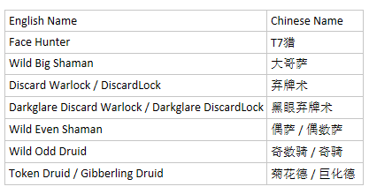

---------------------------
警告!
---------------------------
使用SmartBot软件违反了了“暴雪®战网最终用户许可协议”。

一旦您从此处下载并使用策略文件，视为您接受对使用策略文件的负全部责任，并证明您完全了解并承担使用所造成的包括违反“暴雪®战网最终用户许可协议”在内的一切后果。

如果您不接受所造成的后果请勿下载和复制此代码库的任何文件及代码。

---------------------------

---------------------------
Warning !
---------------------------
Using this software is against 'Activision Blizzard Inc.' TOS/EULA.

Are you sure that you want to continue ? By clicking yes, you accept to take the full responsibility on your usage of this software and you certify that you have full knowledge that the use of this software can lead to a rupture of your personal contract with 'Activision Blizzard Inc.'

---------------------------

Deck Language Comparison Table (You also can seach in DLCT.csv File)

 * 版权信息
 * https://github.com/Waldo-Schaeffer
 * https://gitee.com/m586/Smartbot-Profile
 * Copyleft 2016 - 2020 SunGuanqi. All Lefts Reserved
 * Attribution 4.0 International (CC BY 4.0)
 * 使用时请遵守知识共享署名 4.0 国际许可协议，且不可删除本版权信息
