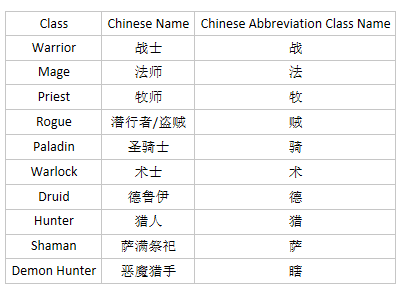

---------------------------
警告!
---------------------------
使用SmartBot软件违反了了“暴雪®战网最终用户许可协议”。

一旦您从此处下载并使用策略文件，视为您接受对使用策略文件的负全部责任，并证明您完全了解并承担使用所造成的包括违反“暴雪®战网最终用户许可协议”在内的一切后果。

如果您不接受所造成的后果请勿下载和复制此代码库的任何文件及代码。

---------------------------

---------------------------
Warning !
---------------------------
Using this software is against 'Activision Blizzard Inc.' TOS/EULA.

Are you sure that you want to continue ? By clicking yes, you accept to take the full responsibility on your usage of this software and you certify that you have full knowledge that the use of this software can lead to a rupture of your personal contract with 'Activision Blizzard Inc.'

---------------------------

炉石传说Smartbot机器人的留牌策略，这里只会存放两个版本以前用的留牌策略文件和所有版本弃坑的策略，想要最新的策略加QQ群1102704028咨询。

this only put old profile who i used to help wirmate update SmartBot AI or study to write profile.

this only put 3 month or 2 version ago's profild and mulligan. The newest profile was CHARGE!!

How to know what profile or rar used for what deck?

1. Use Google Translate to translate filename without last word. For example: 祈求牧==>祈求==Google Translate==>Invoke
2. Use last word find profession in The Image. For example: 祈求牧==>牧==>牧师==>Preist

3. Regroup 2 words. For example: 祈求牧==step 1 and step 2==>Invoke/Preist==>Invoke Preist
4. Some deck need change words with means.  For example: Invoke Preist==>Galakrond always need Invoke==>Galakrond Preist

How can I get the newest profile?

1. If you can't speak Chinese you can use English to send a E-mail to me to advisory / consultative. my E-mail is administrator@sunguanqi.com.
	>[Click here to send me an E-mail](mailto:administrator@sunguanqi.com) "Do not send spam to me!!!"
2. If you can Chinese, Download OICQ/QQ and join Group. Group id is 1102704028 to dvisory / consultative.
	>[Click here to Download OICQ/QQ Page](https://im.qq.com/download/)
	
	>[Click here to Download OICQ/QQ For Windows](https://dldir1.qq.com/qqfile/QQIntl/QQi_PC/QQIntl2.11.exe)
	
	>[Click here to Download OICQ/QQ For Android](https://down.qq.com/qqweb/QQ_1/android_apk/Android_6.0.3.6604_537064871.apk)
	
	>[Click here to Download OICQ/QQ For iPhone](https://itunes.apple.com/cn/app/id710380093?mt=8)
	
	>[Click here to Download OICQ/QQ For Mac](https://im.qq.com/macqq/)

 * 版权信息
 * https://github.com/Waldo-Schaeffer
 * https://gitee.com/m586/Smartbot-Profile
 * Copyleft 2016 - 2020 SunGuanqi. All Lefts Reserved
 * Attribution 4.0 International (CC BY 4.0)
 * 使用时请遵守知识共享署名 4.0 国际许可协议，且不可删除本版权信息
